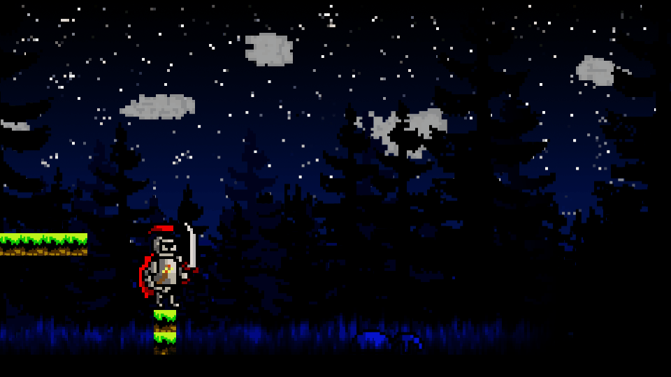
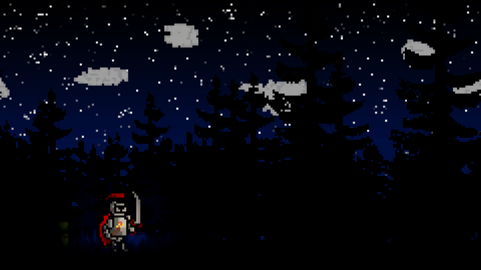

# Darkness Falls

Darkness Falls is a small-scale, sidescrolling platformer currently in development in Unity with an anticipated alpha release date of late April 2022.

## Description

Darkness Falls is my capstone project for my Bachelor of Science in Computer Science at Montana Tech. As such, I don't intend for it to be a full-scale game at this time, but rather a demonstration of my knowledge of game engineering.

My goal is to implement core aspects of side-scrolling platformers with a unique twist: having a single source of light, the player's torch, that replaces a health bar or another similar system. At the start of a level, the torch will be bright and illuminate most of the screen. Slowly over time, the torch's light will fade. Furthermore, taking a hit or using special skills with expediate this loss of light. However, slaying enemies will bolster the torch to allow the player to continue on. Lastly, if the player runs out of light, they lose.

Art Assets are being developed by my friend, Zachary McDonnell, and will be finished and implemented into the game towards the end of pre-alpha in late April 2022. As such, only some sprites and animations are in the game currently.

## Roadmap

- [x] Player Movement Actions
    - [x] Walking
    - [x] Dashing
    - [x] Jumping
- [x] Camera Control
    - [x] Follow Camera
    - [x] Camera Offset and Boundaries
    - [x] Axis Locking
- [x] Dynamic Backgrounds
    - [x] Repeated Backgrounds
    - [x] Distant Backgrounds
- [x] Torch System
    - [x] Lighting
        - [x] Torch Flicker
    - [x] Torch Management
        - [x] Torch Class
        - [x] Torch Controller
        - [x] Torch Radius
- [x] Universal Combat Mechanics
    - [x] Hitboxes
    - [x] Hitbox Responders
    - [x] Hurtboxes
    - [x] Hurtbox Responders
- [ ] Enemies
    - [x] Enemy Controller
    - [x] Slime Enemy
    - [ ] Flying Enemy
- [ ] Player Combat Mechanics
    - [x] Hurtable Player
        - [x] Player Hurtbox
        - [x] Player Hurtbox Responder
    - [ ] Player Attacks
        - [x] Sword Attack
        - [x] Torch Attack
        - [ ] Double Dash Attack
        - [ ] Double Jump Attack
- [ ] Macro Game Logic
    - [x] Game Loss
    - [ ] Game Win
- [ ] Scene Management
    - [ ] Main Menu Scene
    - [ ] Level Transition
- [ ] Animations
    - [ ] Player
        - [x] Idle
        - [ ] Movement
            - [x] Walking
            - [ ] Rising
            - [x] Falling
            - [ ] Dashing
        - [ ] Attacks
            - [ ] Sword
            - [ ] Torch
            - [ ] Double Jumping
            - [ ] Double Dashing
        - [ ] Stunned
        - [ ] Death
    - [ ] Enemies
        - [ ] Slime Enemy
            - [x] Movement
            - [ ] Attack
            - [ ] Stunned
            - [ ] Death
        - [ ] Flying Enemy
            - [ ] Movement
            - [ ] Attack
            - [ ] Stunned
            - [ ] Death
- [ ] UI
    - [ ] Torch Meter
    - [ ] Dash Cooldown Indicator
- [ ] Audio
    - [ ] Background Music
        - [ ] Main Menu
        - [ ] In-Game
    - [ ] Player
        - [ ] Movement
            - [ ] Walking
            - [ ] Jumping
            - [ ] Landing
            - [ ] Dashing
        - [ ] Attacks
            - [ ] Sword
            - [ ] Torch
            - [ ] Double Jumping
            - [ ] Double Dashing
        - [ ] Stunned
        - [ ] Death
    - [ ] Enemies
        - [ ] Slime Enemy
            - [x] Movement
            - [ ] Attack
            - [ ] Stunned
            - [ ] Death
        - [ ] Flying Enemy
            - [ ] Movement
            - [ ] Attack
            - [ ] Stunned
            - [ ] Death
- [ ] Level Design
    - [x] Background
    - [ ] Foreground
        - [x] Grass
        - [ ] Obstacles
        - [ ] Platforms
    - [ ] Enemy Placement

## Game Mechanics and GIFs

### Build Version 0.3

#### Jumping

The player can jump once off the ground and once when in the air. However, the jump in the air will cost the player some of their remaining torchlight. In the future, there will be a blast of fire below the player when they double jump, which can stun normal enemies or kill stunned enemies.

#### Dashing

The player can dash twice when grounded, during which they are immune to enemy attacks. However, the second dash will cost the player some of their remaining torchlight. In the future, the player will be wreathed in fire when they dash a second time, which will stun normal enemies or kill stunned enemies on collision.

#### Dynamic Background - Game View

As the camera moves throughout the game, the background sprites move with it to simulate distance. How distant a sprite is can be individually controlled, allowing for a visually 2.5D environment.

#### Dynamic Background - Scene View

The scene view of the dynamic background system.

#### Dynamic Lighting

Over time, the player's torch will slowly burn out. Falling off the map, taking hits, or performing special actions will reduce their torchlight quicker. However, slaying enemies will provide torchlight back to the player. Here is an example of the player quickly losing torchlight.

#### Hitboxes, Hurtboxes, and On-Hurt Torchlight Loss

In order for combat to occur, the player and enemies must have hitboxes and hurtboxes, which I made custom classes for myself. In this GIF, the player walks over a floating enemy hitbox a few times, demonstrating that they lose some torchlight become immune to further attacks for a short period of time.

### Build Version 0.4

#### Player Attacking and Enemy On-Hurt Reaction

With the new Player Action system and Player Attacking action, the player can now press "J" to attack in front of them. This will normally be a sword swing that can only stun normal enemies or knockback stunned enemies. However, if they buffer a second attack while they are swinging their sword, they can then swing their torch to kill the presumably stunned enemy. The swing of the torch will cost them some torchlight, but it should reward them some back if they manage to successfully kill an enemy. Also, the player cannot move while attacking, although it isn't shown here. At this time, enemies haven't been created yet, so the attacks just change the color of the pushbox the player is attacking.

#### Player On-Hurt Reaction

Upon being hit, the player loses some of their torchlight, becomes immune to further attacks, is prevented from taking any actions, and is knocked back in the opposite direction of the attack. There is a short duration between the player being able to move again and losing their invincibility for them to get out of any sticky situations.

### Build Versions 0.5

#### Idle and Walk Animations

Animations for idle and walking have been added! The rest of the art assets are currently in development, but for now, goodbye Mr. Green Box!

#### Sword Attack

The player's default attack is a swing of their sword this will stun enemies and knock them back if they were already stunned. Unlike last build, there is now an enemy to hit!

#### Torch Attack

If the player attacks again after their sword swing, they will lose torchlight but have a much more powerful attack. This attack can kill stunned enemies, giving the player torchlight back in the process. If the enemy is not killed, they will knocked back and stunned for a long duration. However, this can only be done if the player has some torchlight to lose...

#### Death's Door Attack

If the player has no torchlight remaining, they are on "death's door". They cannot double jump, double dash, or torch attack. However, their sword instantly kills enemies, whether they were stunned or not.

#### Enemy Slime

The first enemy of Darkness Falls is a small slime. This enemy will seek out the player and unleash an attack in every direction. In the future, this enemy will also turn around when facing obstacles.

#### Player Death and Respawn

When the player is hit on death's door or falls off the map, they die and lose the game. For now, this just restarts the level. In the future, there will be a death animation and game over screen. 

### Build Versions 0.6

#### Background Sprites

Here's a taste of what Darkness Falls is really going to look like! A layered parallax-style background gives the world depth, despite only being 2D.

#### Slime Movement

The enemy slime now has an in-game movement animation!

#### Player Death Animation (In Progress)

When the player dies, they now play their death animation (a red idle animation, for the time being) before their torch goes out.

## Build Archive

[Version 0.3](https://simmer.io/@Excile2127/darkness-falls-pre-alpha-version-0-3)

[Version 0.4](https://simmer.io/@Excile2127/darkness-falls-pre-alpha-version-0-4)

[Version 0.5](https://simmer.io/@Excile2127/darkness-falls-pre-alpha-version-0-5)

[Version 0.6](https://simmer.io/@Excile2127/darkness-falls-pre-alpha-version-0-6)

## Opening the Game in the Unity Editor

First, you'll need to clone the project to get the project folder. However, this project uses Git Large Files Support (LFS). Downloading a zip file using the green button on GitHub may not work. You must clone the project with a version of Git that has LFS. You can download GitLFS [here](https://git-lfs.github.com/).

Next, open the project folder through Unity Hub with the version of Unity specified in the dependencies section. From here, you should be able run and examine the game through the Unity editor.

### Dependencies

* [GitLFS](https://git-lfs.github.com/)
* [Unity 2020.3.24f1](https://unity3d.com/get-unity/download/archive)

## Contributers

[Andrew Moreno](https://www.linkedin.com/in/andrew-moreno/): Game Design and Development

[Zachary McDonnell](https://www.instagram.com/_zachmcdonnell_/): Art Assets (In Development)

## Version History
* 0.6
    * Imported most background sprites
        * Background is completed barring a couple of adjustments and additions
            * There is a single black pixel in the sky that needs to be removed
            * Another row of dense trees in the far back needs to be added
            * The front layer of trees needs to be colored and textured
    * Adjusted repeated background script to organize duplicate background sprites
    * Started player animation controller
        * Most animation states are accounted for, but just playing the idle animation until I receive the sprite sheets
    * New player falling animation creates cape billow
    * Finished slime enemy, including animation controller and imported movement animation
        * Still needs animations for attacking, being stunned, and dying
    * Implemented the beginnings of a death transition
        * Player temporarily changes color (but will play a death animation in the future) before their torch goes out
        * Still needs a transition to a "game over" screen
    * Most importantly, fixed background jitter, hopefully for the last time
        * Adjusted numerous camera and sprite settings, too many to count
* 0.5
    * Began putting in animations
        * Idle and walking!
    * Created generic enemy scripts
        * Overarching enemy controller uses enemy movement abstract base class and enemy attack base class
    * Finished combat system
        * Sword attack stuns enemies and knockbacks already stunned enemies
        * Torch attack stuns and knockbacks enemies and kills already stunned enemies
        * Death's door attack (attacking at no torchlight) kills enemies regardless of if they are stunned
    * Implemented Slime enemy
        * Slime movement derived class
        * Slime attack derived class
    * Added high-level game controller
        * Player now dies (and restarts the game) when being hit at low torchlight or when falling off the map
    * Miscellaneous changes
        * Too many to count
        * Most importantly, fixed distant background jittering!

* 0.4
    * Player Action System
        * Replaced Platformer Movement script
        * Scalable, generalized system for controlling the player character through actions
        * Separates walking, jumping, and dashing for specific action blocking
    * Updated Universal Combat Mechanics
        * Hitboxes and Hurtboxes only relate the boxes themselves, Hitbox Responders control the attacks and what happens when they hit, and Hurtbox Responders control what happens every time the Hurtbox is hurt
    * Created Player and Enemy Hitbox and Hurtbox Responders
        * Player Hitbox Responder and Enemy Hurtbox Responder are placeholders, as I need to make the enemies first
        * The Player Hurtbox Responder makes the player stunned and knocked back every time they are hit, and the Enemy Hitbox Responder broadcasts a reduction in torchlight
            * Next release, I'll incorporate checks for player death in the Player Hurtbox Responder\
    * Small, miscellaneous changes
        * Removed linear interpolation from Camera script
            * Caused jittering with dynamic backgrounds
            * Hopefully it's gone... but it keeps coming back
        * Changed Messenger system to only broadcast torchlight updates and new torchlight values
            * Further decoupled the Torch system from the rest of the game
        * Increased friction on the player via adding a PhysicsMaterial2D to the Rigidbody2D
            * Doesn't change the player's movement normally, but causes the player to stop quickly when they attack or are stunned
* 0.3
    * Universal Combat Mechanics
        * Hitboxes
        * Hitbox Responders
        * Hurtboxes
        * Hurtbox Responders
    * Player Hurtbox Responder
    * Enemy Hitbox Responder
* 0.2
    * Completion of the Torch System
        * Includes new Messenger system in both the Torch Controller and the Torch Radius scripts
        * Torch Flicker
    * Moved Camera script's Update to Late Update to prevent jittering
    * Changed background object clones from Distant Background to have the same parent
        * Might expand on this in the future to create a parent object for the original and clones for organization and easy manipulation
* 0.1.2
    * Torch Class
    * Torch Controller
    * Dynamic Torch Radius
* 0.1.1
    * Lighting
    * Temporary sprites placed for Sky and Treeline
* 0.1
    * Player Movement
    * Camera Control
    * Dynamic Backgrounds
    * Intial scene setup