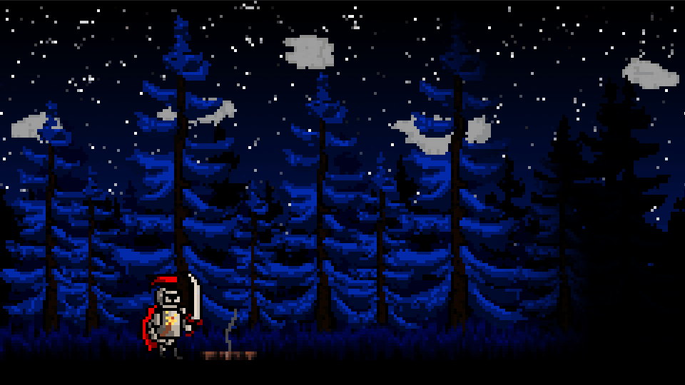
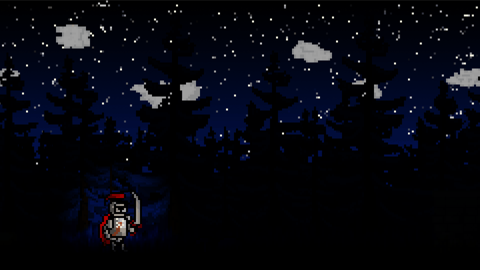

# Darkness Falls

Darkness Falls is a small-scale, sidescrolling platformer developed in Unity C#.

## Description

Darkness Falls is my capstone project for my Bachelor of Science in Computer Science at Montana Tech. As such, I don't intend for it to be a full-scale game at this time, but rather a demonstration of my knowledge of game engineering.

My goal was to implement the core aspects of side-scrolling platformers with a unique twist: having a single source of light, the player's torch, that replaces a health bar or another similar system. At the start of a level, the torch will be bright and illuminate most of the screen. Slowly over time, the torch's light will fade. Furthermore, taking a hit or using special skills with expediate this loss of light. However, slaying enemies will bolster the torch to allow the player to continue on. Lastly, if the player runs out of light, they lose.

## Build Archive

[Version 1.0](https://simmer.io/@Excile2127/darkness-falls-alpha-1-0)

[Version 0.6](https://simmer.io/@Excile2127/darkness-falls-pre-alpha-version-0-6)

[Version 0.5](https://simmer.io/@Excile2127/darkness-falls-pre-alpha-version-0-5)

[Version 0.4](https://simmer.io/@Excile2127/darkness-falls-pre-alpha-version-0-4)

[Version 0.3](https://simmer.io/@Excile2127/darkness-falls-pre-alpha-version-0-3)

## Game Mechanic GIFs

### Player Actions

Here's all of the actions the player can take!

#### Walking

The player can move horizontally by pressing A and D.

#### Jumping

The player can jump and double jump by pressing Spacebar.

#### Dash and Double Dash

The player can dash by pressing Left Shift. During this time or shortly thereafter, the player can perform a double dash by pressing Left Shift again. Both dashes make the player immune to enemy attacks and the second dash is an attack that can stun and knockback enemies (or kill them if stunned). However, double dashing costs the player some of their remaining torchlight.

#### Normal Attacks

The player can swing their sword by pressing J. During this time, if they press J again, they will buffer a second swing immidietely after the first. The first swing stuns enemies and the second swing can kill enemies if stunned (or stun and knock them back otherwise). However, double attacking costs the player some of their remaining torchlight.

#### Death's Door Attack

If the player has no remaining torchlight, they are on Death's Door. They cannot double dash or double attack, but their normal attack has been strengthened to instantly kill enemies.

### Slimes

The only enemy of Darkness Falls is a small slime. These aimlessly wander around the map until they see the player, where they then move towards them. Once a slime is close enough to strike, they attack around themselves in a short radius. If the player is hit, they either lose torchlight or die if they have no torchlight remaining. Killing slimes rewards the player with extra torchlight.

### Main Menu

From the main menu, the player can begin the game.

### Pause Menu

The player can pause or unpause the game at any time by pressing Escape. In the pause menu, the player can restart the level or return to the main menu.

### Losing the Game

If the player dies by being hit at low torchlight, they lose the game. From the game over screen, the player can restart or return to the main menu.

### Winning the Game

If the player kill every enemy in the level, they win the game. From the game won screen, the player can restart or return to the main menu.

## Roadmap

- [x] Player Movement Actions
    - [x] Walking
    - [x] Dashing
    - [x] Jumping
- [x] Camera Control
    - [x] Follow Camera
    - [x] Camera Offset and Boundaries
    - [x] Axis Locking
- [x] Dynamic Backgrounds
    - [x] Repeated Backgrounds
    - [x] Distant Backgrounds
- [x] Torch System
    - [x] Lighting
        - [x] Torch Flicker
    - [x] Torch Management
        - [x] Torch Class
        - [x] Torch Controller
        - [x] Torch Radius
- [x] Universal Combat Mechanics
    - [x] Hitboxes
    - [x] Hitbox Responders
    - [x] Hurtboxes
    - [x] Hurtbox Responders
- [x] Enemies
    - [x] Enemy Controller
    - [x] Slime Enemy
        - [x] Slime Attack
        - [x] Slime Movement
- [x] Player Combat Mechanics
    - [x] Hurtable Player
        - [x] Player Hurtbox
        - [x] Player Hurtbox Responder
    - [x] Player Attacks
        - [x] Sword Attack
        - [x] Fire Attack
        - [x] Death's Door Attack
        - [x] Double Dash Attack
- [x] Macro Game Logic
    - [x] Game Loss
    - [x] Game Win
- [x] Scene Management
    - [x] Main Menu Scene
    - [x] Game Over Scene
    - [x] Game Won Scene
    - [x] Scene Fader
- [x] Animations
    - [x] Player
        - [x] Idle
        - [x] Movement
            - [x] Walking
            - [x] Rising
            - [x] Falling
            - [x] Double Jumping
            - [x] Dashing
        - [x] Attacks
            - [x] Sword
            - [x] Fire
            - [x] Death's Door
            - [x] Double Dashing
        - [x] Stunned
        - [x] Death
    - [x] Enemies
        - [x] Slime Enemy
            - [x] Movement
            - [x] Attack
            - [x] Stunned
            - [x] Death
- [x] UI
    - [x] Level Banner
- [x] Audio
    - [x] Audio Manager
    - [x] Background Music
        - [x] Main Menu
        - [x] In-Game
        - [x] Game Over
        - [x] Game Won
- [x] Level Design
    - [x] Background
    - [x] Foreground
        - [x] Obstacles
        - [x] Enemy Placement
        - [x] Decorations
- [ ] Dropped Mechanics and Functionality
    - [ ] Sound Effects
        - Support is in place to play sound effects, but none are imported into the game.
    - [ ] Flying Enemy
        - Support is in place to make new enemy types, but enemy-specific functionality and assets are missing.
    - [ ] Multiple Levels
        - Support is in place to add new levels, but none are designed.
    - [ ] UI Torch Meter
        - Support is in place to communicate with a Torch UI element, but it doesn't exist.
    - [ ] Options Menu
        - Not even supported :P

## Opening the Game in the Unity Editor

First, you'll need to clone the project to get the project folder. However, this project uses Git Large Files Support (LFS). Downloading a zip file using the green button on GitHub may not work. You must clone the project with a version of Git that has LFS. You can download GitLFS [here](https://git-lfs.github.com/).

Next, open the project folder through Unity Hub with the version of Unity specified in the dependencies section. From here, you should be able run and examine the game through the Unity editor.

### Dependencies

* [GitLFS](https://git-lfs.github.com/)
* [Unity 2020.3.24f1](https://unity3d.com/get-unity/download/archive)

## Contributers

[Andrew Moreno](https://www.linkedin.com/in/andrew-moreno/): Game Design and Development

[Zachary McDonnell](https://www.instagram.com/_zachmcdonnell_/): Art Assets

[Brullov](https://itch.io/profile/brullov/): Rock and Fire Art Assets

[Aamatniekss](https://aamatniekss.itch.io/): Rock Wall Art Assets

[FesliyanStudios](https://www.fesliyanstudios.com/): Music Assets

## Version History
* 1.0
    * I finished the game :P
* 0.6
    * Imported most background sprites
        * Background is completed barring a couple of adjustments and additions
            * There is a single black pixel in the sky that needs to be removed
            * Another row of dense trees in the far back needs to be added
            * The front layer of trees needs to be colored and textured
    * Adjusted repeated background script to organize duplicate background sprites
    * Started player animation controller
        * Most animation states are accounted for, but just playing the idle animation until I receive the sprite sheets
    * New player falling animation creates cape billow
    * Finished slime enemy, including animation controller and imported movement animation
        * Still needs animations for attacking, being stunned, and dying
    * Implemented the beginnings of a death transition
        * Player temporarily changes color (but will play a death animation in the future) before their torch goes out
        * Still needs a transition to a "game over" screen
    * Most importantly, fixed background jitter, hopefully for the last time
        * Adjusted numerous camera and sprite settings, too many to count
* 0.5
    * Began putting in animations
        * Idle and walking!
    * Created generic enemy scripts
        * Overarching enemy controller uses enemy movement abstract base class and enemy attack base class
    * Finished combat system
        * Sword attack stuns enemies and knockbacks already stunned enemies
        * Torch attack stuns and knockbacks enemies and kills already stunned enemies
        * Death's door attack (attacking at no torchlight) kills enemies regardless of if they are stunned
    * Implemented Slime enemy
        * Slime movement derived class
        * Slime attack derived class
    * Added high-level game controller
        * Player now dies (and restarts the game) when being hit at low torchlight or when falling off the map
    * Miscellaneous changes
        * Too many to count
        * Most importantly, fixed distant background jittering!
* 0.4
    * Player Action System
        * Replaced Platformer Movement script
        * Scalable, generalized system for controlling the player character through actions
        * Separates walking, jumping, and dashing for specific action blocking
    * Updated Universal Combat Mechanics
        * Hitboxes and Hurtboxes only relate the boxes themselves, Hitbox Responders control the attacks and what happens when they hit, and Hurtbox Responders control what happens every time the Hurtbox is hurt
    * Created Player and Enemy Hitbox and Hurtbox Responders
        * Player Hitbox Responder and Enemy Hurtbox Responder are placeholders, as I need to make the enemies first
        * The Player Hurtbox Responder makes the player stunned and knocked back every time they are hit, and the Enemy Hitbox Responder broadcasts a reduction in torchlight
            * Next release, I'll incorporate checks for player death in the Player Hurtbox Responder\
    * Small, miscellaneous changes
        * Removed linear interpolation from Camera script
            * Caused jittering with dynamic backgrounds
            * Hopefully it's gone... but it keeps coming back
        * Changed Messenger system to only broadcast torchlight updates and new torchlight values
            * Further decoupled the Torch system from the rest of the game
        * Increased friction on the player via adding a PhysicsMaterial2D to the Rigidbody2D
            * Doesn't change the player's movement normally, but causes the player to stop quickly when they attack or are stunned
* 0.3
    * Universal Combat Mechanics
        * Hitboxes
        * Hitbox Responders
        * Hurtboxes
        * Hurtbox Responders
    * Player Hurtbox Responder
    * Enemy Hitbox Responder
* 0.2
    * Completion of the Torch System
        * Includes new Messenger system in both the Torch Controller and the Torch Radius scripts
        * Torch Flicker
    * Moved Camera script's Update to Late Update to prevent jittering
    * Changed background object clones from Distant Background to have the same parent
        * Might expand on this in the future to create a parent object for the original and clones for organization and easy manipulation
* 0.1.2
    * Torch Class
    * Torch Controller
    * Dynamic Torch Radius
* 0.1.1
    * Lighting
    * Temporary sprites placed for Sky and Treeline
* 0.1
    * Player Movement
    * Camera Control
    * Dynamic Backgrounds
    * Intial scene setup